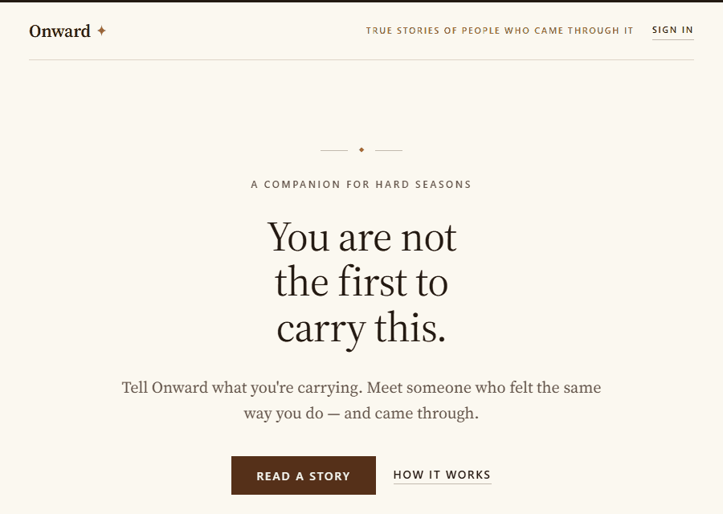
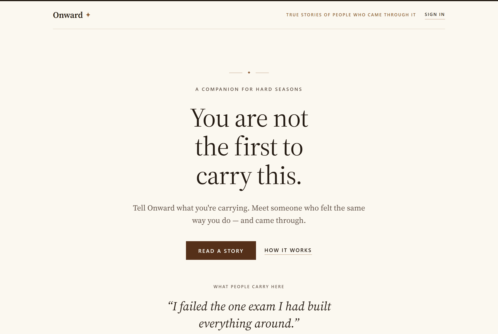
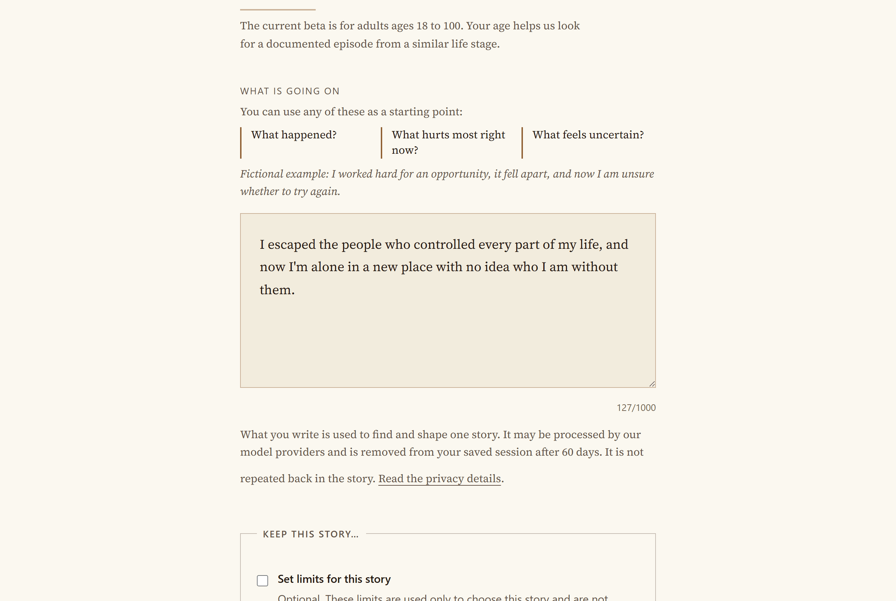
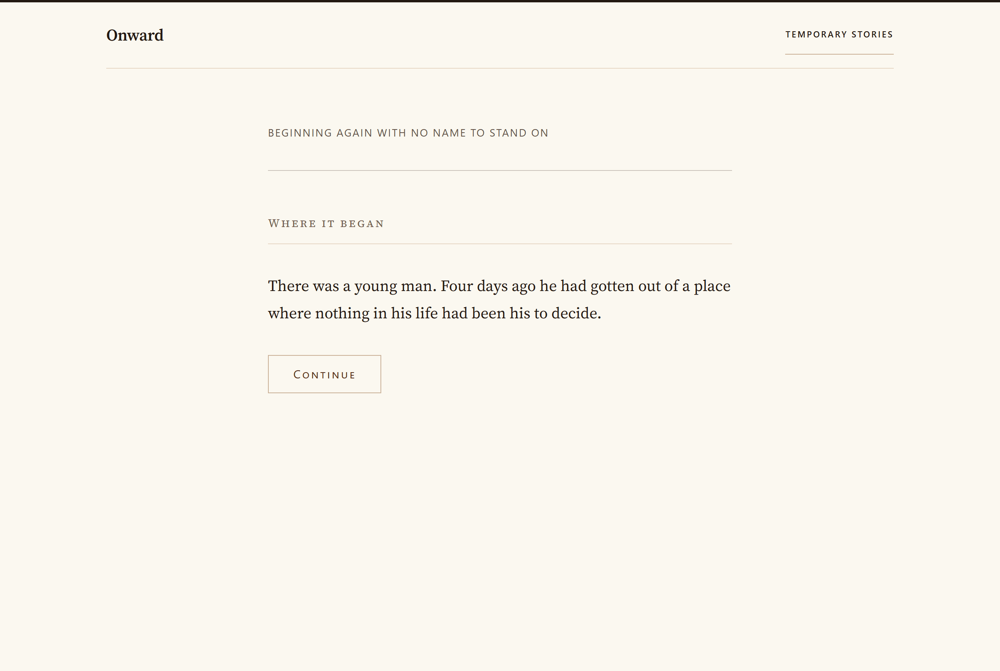
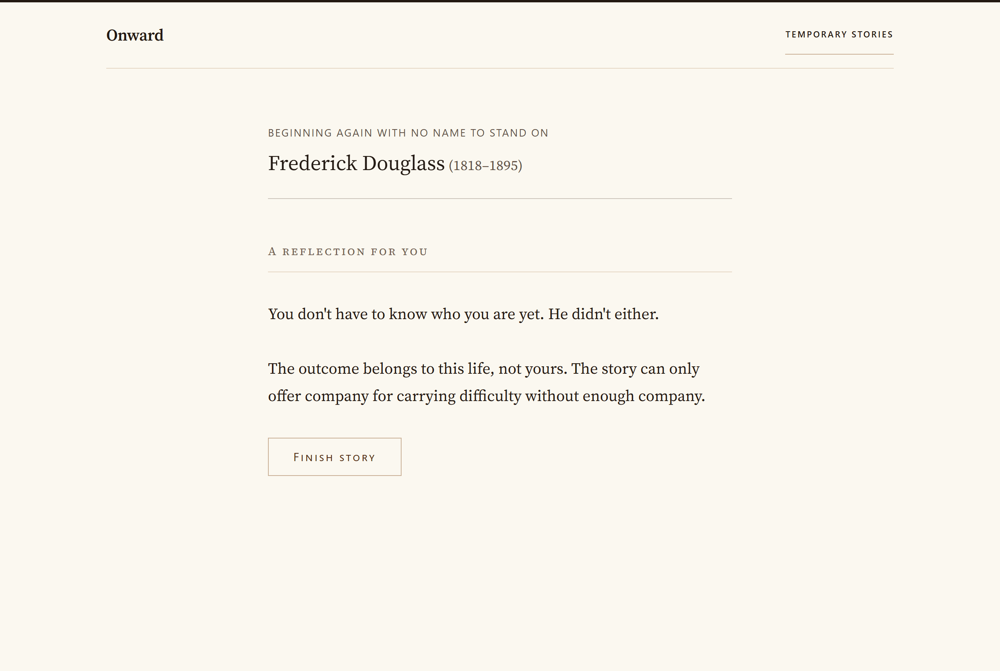
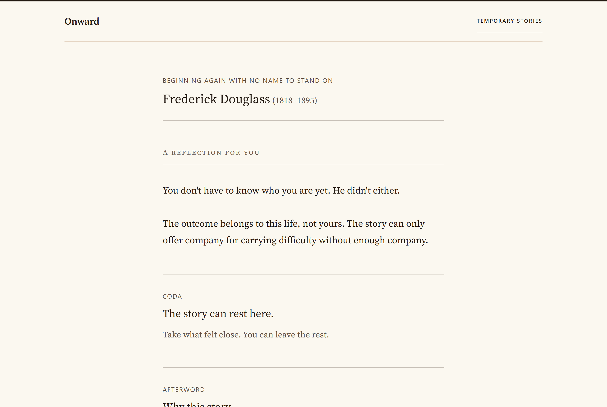
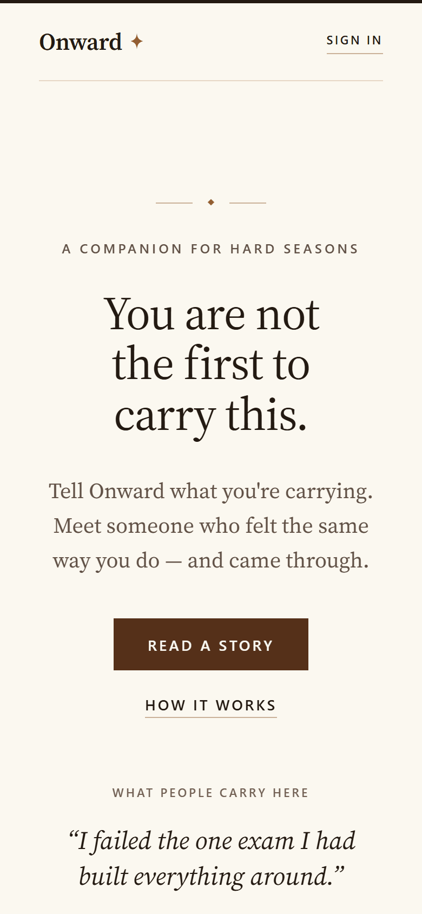

<p align="center">
  
</p>

<h1 align="center">Onward</h1>

<p align="center"><em>You are not the first to carry this.</em></p>

<p align="center">
  Tell Onward what you are carrying. It finds a real person whose documented life held the same hard season,
  and walks you through that episode one page at a time, at your pace, until the story turns back to you.
</p>

<p align="center">
  <a href="https://onwardapp.me">Live app</a> ·
  <a href="#quick-start">Quick start</a> ·
  <a href="#how-it-works">How it works</a> ·
  <a href="#privacy-and-safety">Privacy and safety</a> ·
  <a href="#adding-a-figure">Adding a figure</a> ·
  <a href="docs/DEPLOYING.md">Deploying</a>
</p>

---

Onward is a small web app for people in a hard moment: a failed exam, a lonely move, a door that just closed. You write a few honest sentences and your age. Onward matches them against a hand-authored library of emotional episodes from real historical lives, picks the one that rhymes closest, and streams a short seven-part narrative. The figure's name is withheld until the final page, so you meet the person before you meet the legend.

It is built around three refusals: no invented history (the people, events, dates, and words are documented; where a passage renders a moment in scene, the afterword lists exactly which lines are ours), no unearned intimacy, and no memory of you that you did not ask for.

## Demo

<p align="center">
  
</p>

| Landing | Intake | A passage |
| --- | --- | --- |
|  |  |  |

| The reveal | The coda | Phone |
| --- | --- | --- |
|  |  |  |

Every image above was captured from a zero-config local run (`npm run dev`), so what you see is exactly what a fresh clone produces.

## Quick start

You need Node 22. Nothing else: no database, no API keys, no accounts.

```bash
git clone https://github.com/taizhenC/Onward.git
cd Onward
npm install
npm run dev
```

Open <http://localhost:3000>, press **Read a story**, and write something true.

This default *memory mode* runs entirely in-process: sessions live in memory, the figure library is served from the authored constant, matching uses a keyword router instead of the LLM reranker, and the prose is the hand-authored text streamed word by word. It is the same reader, the same library, and the same privacy rules as production, minus the network. One visible difference: the afterword marks each story's source mapping as an editorial draft, because only stories that have passed evidence review in the database clear that banner.

To run the full stack (Supabase persistence and auth, Cerebras reranking, optional Gemini embeddings), copy `.env.example` to `.env.local`, fill in the sections you want, and follow [`docs/DEPLOYING.md`](docs/DEPLOYING.md).

## How it works

### The reader's path

1. **Intake** (`/begin`). Age and a few sentences. Optional limits let you keep certain topics or intensities out of the story. Crisis resources are on the page before you type anything, and on the landing page without any detection at all.
2. **Crisis gate.** A deterministic regex runs before authentication, before rate limiting, and before any model call. If it matches, the app shows crisis resources and persists nothing: no session, no embedding, no provider request. This path is never rate-limited.
3. **Matching.** Stages within ten years of your age form the pool. Retrieval narrows it to a handful, an LLM reranker judges emotional fit from each candidate's biographical facts, and the result is framed as either a close match or a *partial parallel*. When the fit is genuinely uncertain, the app asks one bounded question rather than guessing, and when nothing fits it says so.
4. **Preface.** A few lines of comfort and, when it applies, an honest note that the parallel is only adjacent. No name yet.
5. **Seven passages**, streamed and acknowledged one at a time: where it began, the dark moment, the response, the struggle, the turning point, what they became, and a reflection written back to you. Progress is never shown as "4 of 7".
6. **Afterword.** Why this story was chosen, then a folded section the reader can open: who this was, what really happened claim by claim with its evidence, the lines we wrote as scene detail, the quotations, and where to read more. A reader can flag any single fact for editorial review without sending anything about themselves.
7. **Afterwards.** One bounded question (did this feel close?), an optional one-use alternate story if it did not, and the choice to keep the story by adding an email. Nothing is kept unless you ask.

### The library

The retrievable unit is not a person but a **stage**: one emotional episode, organised around one down moment, with a documented age range. Each stage carries three deliberately separated surfaces:

- **Shape sentences and facets** describe the emotional shape of the episode. They are used for retrieval only.
- **Biographical facts** are primary-source facts scoped to the episode. They are the only thing the reranker reads.
- **Beats** are the seven authored passages, each with a structural role and a provenance note.

Keeping retrieval text away from the reranker is the *anti-echo* rule: the model must judge fit from facts, not confirm what similarity search already said. The library holds 50 stages (about 48,000 words, a five-minute read each), tagged from a controlled vocabulary of 23 themes, weighted toward ages 15 to 30, with subjects ranging from a six-year-old who stopped speaking to a sixty-five-year-old who was broke. Every entry in `lib/figures-data.ts` records what is documented, what is interpretive, and what must not be said. In production a stage becomes matchable only after its evidence-bound StorySpec passes review.

### Matching modes and recipes

- **Keyword retrieval** is the production path. Under the LLM reranker it reaches 98% top-1 on the 104-case gold set with zero definitive-wrong matches, and the trust gate fails loudly rather than degrading quietly.
- **FacetsRAG** is a six-lane semantic challenger (shape, four facet lanes, and a deterministic theme lane fused with reciprocal rank fusion over in-memory cosine). It wins on metaphor-heavy inputs and stays behind an eval gate until it wins overall.
- **The model never writes story prose.** Passages are the authored text. Where the composer personalises the transition and the reflection, the model may only choose template identifiers from a closed allowlist; code renders them, validates the result, and falls back to the canonical text on any failure.
- A served deployment does not pick any of this with loose flags. `config/story-recipes.json` is an immutable manifest; `ONWARD_PRODUCTION_RECIPE_ID` selects one entry, and that entry fixes retrieval, models, prompts, embedder, and composer behaviour. Changing production behaviour is a reviewed promotion with content-addressed evidence, not an environment edit.

### Persistence modes

| | `PERSISTENCE=memory` (default) | `PERSISTENCE=supabase` |
| --- | --- | --- |
| Sessions | in-process | Postgres, owned by an anonymous Supabase Auth user |
| Figures | authored constant | `figure_stages` and reviewed `story_specs` tables |
| Sign-in | fixed local user | anonymous-first; optional email link or password to keep stories |
| Rate limit | in-process counters | 5 per hour and 30 per day per user, plus a hashed-IP backstop, durable in Postgres |
| Telemetry | in-memory contract checks | closed, identifier-free daily rollups inside Postgres |

## Privacy and safety

The product is for hurting people, so the privacy rules are enforced in code and tested in CI, not left to convention.

- **Anonymous by default.** No account is needed. A guest account and every story in it are deleted about six hours after its last activity.
- **Stories are owned.** Another person's story URL is a 404 that is indistinguishable from a missing one.
- **Your words expire.** The disclosure is deleted 60 days after it was written, saved story or not, and earlier if you delete the story or the account. Owners can hard-delete any story or the whole account without contacting anyone.
- **Nothing sensitive is logged.** Prompts, provider responses, disclosures, raw IPs, and raw errors never reach logs or telemetry, including on error paths. Telemetry accepts only closed event names and unlinkable identifiers. Historical concern reports carry only library identifiers and a closed reason; they currently have no automatic expiry or user-controlled deletion because nothing in them can identify a reader.
- **Crisis first.** The crisis check is regex-only, runs before any model call, persists nothing, and cannot be rate-limited. The resources it shows link each service's own page and were reviewed on the date recorded in `lib/safety.ts`.
- **The browser never talks to the database.** It calls Supabase Auth endpoints only, with the public anon key; every table is behind default-deny row-level security and is read server-side through the service role or security-definer functions.

The plain-language version of these promises is the app's privacy page (`app/privacy/page.tsx`); the operational detail is in [`docs/SAFETY_RUNBOOK.md`](docs/SAFETY_RUNBOOK.md) and [`roadmap/telemetry_contract.md`](roadmap/telemetry_contract.md). To report a vulnerability privately, see [`SECURITY.md`](SECURITY.md).

## Project layout

```
app/                Next.js App Router: landing, /begin, /story/[id], /stories, /account, /signin,
                    /privacy, and the API routes (match, beat, feedback, deletion, telemetry)
components/         The reader (StoryPlayer, StoryBeat, PrefaceCard, StoryAfterword), the intake form,
                    the crisis card, sign-in and save cards, the landing-page demo
lib/                Everything server-side, grouped by prefix:
  figures*          the authored library and its two sources (constant, database)
  matching, keyword-match, facets-retrieval, rrf, themes, match-config, match-recovery*
                    retrieval, reranking, framing, and the one-question recovery path
  llm*, embeddings* provider boundaries; the stub implementations are the default
  safety, crisis-language, rate-limit
                    the crisis gate and the limiter
  story-*, hybrid-composition, chunks, opening-copy*, resonance-brief*
                    StorySpecs, composition, immutable artifacts, playback, boundaries, transparency
  session*, auth, supabase/, db, persistence
                    sessions, ownership, and the two persistence modes
  telemetry-*       the privacy-safe telemetry contract
  *-deletion*, resonance-feedback*, alternate-story*, historical-concern*, owner-story-save*
                    what an owner can do after a story
config/             Immutable recipe manifest, prompt releases, quality policy, decision records
supabase/           Migrations 0001 to 0024 and a rollout script (schema and functions only; no data)
evals/              Gold sets (match, crisis) and content-addressed evaluation evidence
scripts/            check-* validators wired into CI, evals, seeding, and the smoke suite
prompts/            The authoring template for figure beats
docs/               Deploy runbook, safety runbook, decision records, dated design records, demo assets
roadmap/            Beta release contract, backlog, telemetry contract, story-quality protocol
```

## Configuration

`.env.example` documents every variable. The short version:

| Variable | Purpose |
| --- | --- |
| `PERSISTENCE` | `memory` (default) or `supabase` |
| `NEXT_PUBLIC_SUPABASE_URL`, `NEXT_PUBLIC_SUPABASE_ANON_KEY` | public; the browser uses them for auth endpoints only |
| `SUPABASE_SERVICE_ROLE_KEY` | secret, server-only, bypasses RLS |
| `IP_HASH_SALT`, `TELEMETRY_ID_SECRET` | secrets; required with Supabase; generate each with `openssl rand -hex 32` |
| `CEREBRAS_API_KEY`, `CEREBRAS_BASE_URL` | reranking and opening copy in real mode |
| `GEMINI_API_KEY` | only when the selected recipe uses FacetsRAG embeddings |
| `ONWARD_PRODUCTION_RECIPE_ID` | required in production; the sole behaviour selector |
| `LLM_PROVIDER`, `EMBEDDING_PROVIDER`, `RETRIEVAL_MODE` | local and eval controls; ignored by served production |
| `STORY_CREATION_ENABLED` | emergency switch; `false` pauses new stories while crisis resources stay up |

## Scripts

```bash
npm run dev            # local server, memory mode
npm run build          # production build
npm run lint           # eslint, zero warnings allowed
npm run typecheck      # tsc --noEmit
npm run smoke          # hermetic end-to-end regression suite (memory + stubs)
npm run eval-crisis    # crisis regex regression set; a false negative fails
npm run eval           # match eval against evals/match.json (see Evaluation)
npm run check-figure   # structural validation of the library
npm run seed           # seed figures and stages to Supabase
npm run check-db       # Supabase acceptance check after seeding
```

CI runs about fifty `check-*` scripts in addition to lint, typecheck, the crisis eval, the smoke suite, and a production build, all offline with stub providers. Each script asserts a specific contract (telemetry privacy, story boundaries, deletion cascades, accessibility tokens, recipe immutability), and many of them assert on literal markup or copy, so read the relevant script before changing a component or a document it cites. `.github/workflows/ci.yml` is the canonical list.

## Evaluation

`evals/match.json` holds 104 hand-graded cases: 3 deliberate misses and 44 hard confusion cases across 25 groups. A matching change is judged by top-1 accuracy, miss detection, hard-pair confusion, and definitive-wrong count. Evidence for a promoted recipe is content-addressed under `evals/history/` and `evals/shadow/`, and CI refuses edits to it.

```bash
LLM_PROVIDER=stub RETRIEVAL_MODE=keyword npm run eval           # offline harness self-test
EVAL_CONCURRENCY=1 RETRIEVAL_MODE=keyword npm run eval          # real reranker; needs CEREBRAS_API_KEY
npm run eval-retrieval                                          # FacetsRAG Stage A/B gold survival, no reranker
```

## Adding a figure

The library is the product. A stage is done only when all three land:

1. Author the stage in `lib/figures-data.ts` following [`prompts/figure-beats.md`](prompts/figure-beats.md): one clean through-line sentence, four facets each supported by the biographical facts, seven beats in the fixed role order, no name or era markers before the final beat, and a provenance comment.
2. Route it in `STUB_KEYWORD_MAP` in `lib/match-config.ts` so the keyword matcher can reach it.
3. Add gold cases to `evals/match.json`, including at least one hard confusion pair against its nearest neighbour.

Then run `npm run check-figure`, `npm run smoke`, and the real eval. A content change ships as a library release: the real reranker has to pass the trust gate on the new snapshot, and the passing evidence is recorded with the snapshot's hash in `config/figure-library-releases.json`. The procedure is in [`docs/DEPLOYING.md`](docs/DEPLOYING.md#figure-library-releases).

## Contributing

Before opening a pull request run `npm run lint`, `npm run typecheck`, `npm run smoke`, and the `check-*` scripts for the area you touched. Keep commits small and one concern each. The design conventions (paper and ink palette, Source Serif 4 with real small caps, no shadows or gradients, passages that fade in) and the engineering invariants are in `CLAUDE.md`; the domain vocabulary is in `CONTEXT.md`. By contributing you agree that your contribution is licensed under the MIT License.

## License

Onward is released under the [MIT License](LICENSE). The figure library reproduces only short quotations from primary sources; the Source Serif 4 fonts are distributed under the SIL Open Font License (see `app/fonts/OFL.txt`).
