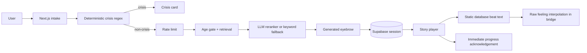
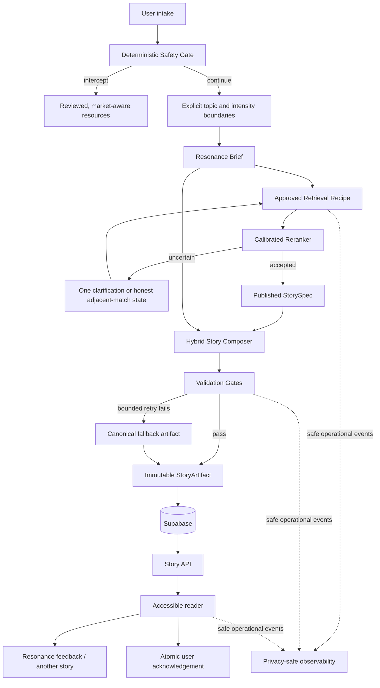

# Technical Architecture

## Architectural recommendation

Keep Onward as a **modular Next.js/Supabase application for the public release**, but replace the current static beat path with an evidence-grounded Story Composer that creates one validated, immutable story artifact per session.

A microservice rewrite is not justified at the current scale. The high-risk problem is semantic correctness, not request volume. The necessary major refactor is inside the domain model and generation pipeline: make facts addressable, isolate user-derived data, validate every personalized artifact, persist the result once, and serve it reliably. Service extraction can follow measured bottlenecks later.

## Current-state architecture



### Current components

| Layer | Implementation | Assessment |
|---|---|---|
| Web application | Next.js App Router, React, TypeScript, Tailwind, Motion | Appropriate for the next release; no framework rewrite needed. |
| Identity | Supabase anonymous auth, email/password or link upgrade | Strong low-friction foundation; user data controls are incomplete. |
| Persistence | Supabase/Postgres via server-only service role | Appropriate, but session and content updates need stronger atomicity and lifecycle semantics. |
| Historical content | `figures`, `figure_stages`, JSON beats, sources | Good editorial starting point; not granular enough for runtime claim validation. |
| Retrieval | Age gate, keyword hybrid or six-lane in-memory cosine, top-K pool | Pluggable and testable; latest evidence favors keyword in production. |
| Reranking | GPT-OSS 120B through an OpenAI-compatible REST boundary | Sensible provider isolation and degraded fallback. |
| Prose | Generated eyebrow only; all beats use stub streamer | Does not yet deliver personalized narrative generation. |
| Story delivery | Server chunking, streamed text, client reveal timer | Good separation of network from visual pacing; progress acknowledgement is semantically wrong. |
| Safety | Pre-provider deterministic regex | Correct placement; coverage, review, localization, and regression process are incomplete. |
| Privacy | Owned sessions, default-deny tables, hashed IP, TTL jobs | Better than a typical MVP; derived prose and deletion need explicit treatment. |
| Evaluation | Matching benchmark, retrieval benchmark, content validator, smoke | Strong start; lacks end-to-end story, safety, privacy, and production-quality gates. |

## Architecture strengths to retain

1. **Provider boundaries.** `lib/llm.ts`, `lib/embeddings.ts`, and `lib/session.ts` keep provider details away from product routes.
2. **Stage as the retrieval unit.** `(figure_key, stage_id)` represents one emotional episode and should remain the core content identity.
3. **Anti-echo retrieval surfaces.** Shape/facet embedding text and rerank biography should remain separated.
4. **Recovery asymmetry.** A degraded but honest canonical story is preferable to a failed request; retrieval recall and generative validation should have different failure strategies.
5. **Recipe versioning.** Session metadata already contains the seeds of reproducible experiments.
6. **Client-owned reveal pacing.** The server sends text without artificial word delays; the reader controls animation locally.
7. **Anonymous-first ownership.** The private-session 404 behavior and server-only data plane are sound patterns.

## Architecture gaps

### Story generation and truth

- Facts are stored in large prose strings, so there is no deterministic claim-to-source mapping.
- Canonical beats mix documented events, interpretation, and dramatized texture in the same `text` field.
- `sourceNotes` are useful for editors but not normalized or enforced.
- The real prose provider does not generate story beats.
- The raw disclosure is directly inserted into the final bridge.
- There is no generation artifact, validation status, generation attempt, or canonical fallback reason persisted per session.

### Matching

- The LLM is told to choose even when none is genuinely close.
- Confidence is self-reported and hidden from the reader.
- Current vector facet lanes reuse one raw-feeling embedding, even though each facet is a different semantic task.
- Eval history is mutable and documentation conflicts with the latest stored result.
- Real-user coverage and calibration are unknown.

### Reliability and state

- The session store's `updateSession` is a blind update without an expected-position compare-and-set.
- The client acknowledges delivery before user Continue intent.
- Full story content is assembled at read time from mutable stage data; a later stage edit can change an old session's story.
- `maxDuration=60` is a timeout allowance, not a latency strategy.
- There is no production event/trace contract or fallback dashboard.

### Privacy and safety

- Raw disclosure, derived copy, persisted story, feedback, and event retention are not modeled as explicit data classes in code.
- The planned taint wrappers and string-hostile trace schema are documented but not implemented.
- Safety regression, reviewed market resource configuration, and operational incident controls are missing.
- Owner-scoped story and account deletion now exist through migrations `0018` and `0019`; the complete retention/privacy surface and real deployment proof remain absent.

## Target architecture



## Architecture decisions mapped to the roadmap

| Decision | Priority | Type | Roadmap link | Rationale |
|---|---|---|---|---|
| Introduce evidence-addressable `StorySpec` | P0 | [Refactor] | P0-02 | Runtime factual validation is impossible against prose blobs. |
| Generate and persist one immutable `StoryArtifact` | P0 | [Refactor] | P0-03 | Guarantees replay, stable reading, validation-before-display, and provider-independent delivery. |
| Remove raw disclosure interpolation | P0 | [Bug Fix] | P0-04 | Protects privacy, tone, and retention coherence. |
| Add calibrated clarification/no-match states | P0 | [Feature] | P0-05 | The system must be allowed to admit uncertainty. |
| Move acknowledgement to explicit Continue and make it atomic | P0 | [Bug Fix] | P0-09 | Corrects resume and concurrency semantics. |
| Implement a closed telemetry schema | P0 | [Feature] | P0-11 | Enables learning without logging intimate text. |
| Pin production retrieval to an approved manifest | P0 | [Bug Fix] | P0-13 | Prevents configuration drift from selecting a weaker matcher. |
| Finish explicit retention classes around shipped story/account deletion | P0 | [Feature] | P0-14 | Extends both deletion authorities into a complete, reviewable data lifecycle. |
| Enforce user-selected content boundaries before matching | P0 | [Feature] | P0-17 | A reader's explicit safety boundary must never be overridden by relevance scoring. |
| Add facet projections only as a shadow challenger | P1 | [Refactor] | P1-01 | Retrieval sophistication must earn promotion through measured gains. |
| Persist stable reading preferences only through explicit consent | P1 | [Feature] | P1-14 | Repeat utility does not justify silently retaining a psychological profile. |
| Add a durable job queue only if measured generation latency requires it | P1 | [Refactor] | P1-10 | Avoids premature distributed complexity while preserving a scale path. |
| Move cosine to database-native vector search only at measured scale | P2 | [Refactor] | P2-05 | Fifty stages do not justify a vector-infrastructure migration. |

## P0-02 — [Refactor] `StorySpec`: target content contract

The `StorySpec` is an immutable, published editorial artifact. It separates what happened, what editors infer, what prose may say, and how evidence supports each claim.

```ts
type StorySpec = {
  storySpecId: string;
  figureKey: string;
  stageId: string;
  version: number;
  status: "draft" | "review" | "published" | "retired";
  episode: {
    ageMin: number;
    ageMax: number;
    startDate?: string;
    endDate?: string;
    throughLine: string;
  };
  contentProfile: {
    intensity: "gentle" | "moderate" | "direct";
    flags: ContentFlag[];
    contentNote: string;
  };
  facts: FactAtom[];
  entities: AllowedEntity[];
  quotes: QuoteRecord[];
  arc: StoryBeatSpec[];
  interpretations: InterpretationRule[];
  avoidRules: string[];
  sources: SourceRecord[];
  review: {
    researcherId: string;
    historicalReviewerId: string;
    toneReviewerId: string;
    reviewedAt: string;
  };
};

type FactAtom = {
  factId: string;
  statement: string;
  sourceRefs: SourceRef[];
  eventOrder: number;
  confidence: "documented" | "probable" | "disputed";
  allowedParaphrases?: string[];
};

type StoryBeatSpec = {
  role:
    | "scene"
    | "dark_moment"
    | "response"
    | "struggle"
    | "turning_point"
    | "became"
    | "bridge";
  requiredFactIds: string[];
  optionalFactIds: string[];
  canonicalText: string;
  personalizationZones: Array<
    "none" | "emphasis" | "transition" | "reader_bridge"
  >;
};
```

### Content rules

- A **fact atom** carries a claim that can be independently supported.
- An **interpretation** may explain emotional shape but cannot introduce a new event.
- A **dramatization limit** says what cannot be invented: interior monologue, private gestures, weather, room detail, dialogue, or causality without support.
- A **quote record** distinguishes exact text from paraphrase and disputed wording.
- A **canonical beat** is the guaranteed fallback, not a prompt suggestion.
- A published spec is immutable. Corrections produce a new version and can retire the old version for new sessions while old artifacts remain auditable.

## P0-03 — [Refactor] `ResonanceBrief`: bounded personalization input

The composer should not receive the raw disclosure everywhere. A dedicated analyzer creates a short-lived structure with explicit provenance. The raw text remains available only to authorized boundaries: crisis check, retrieval/rerank, the analyzer, and an audited replay path.

```ts
type ResonanceBrief = {
  version: string;
  primaryPressure:
    | "loss"
    | "rejection"
    | "isolation"
    | "identity"
    | "blocked_agency"
    | "shame"
    | "uncertainty"
    | "exhaustion"
    | "other";
  emotionalCore: string;       // sensitive derived text
  situationShape: string;      // sensitive derived text
  desiredDistance: "gentle" | "direct" | "unspecified";
  anchors: Array<{ sourceSpanHash: string; concept: string }>;
  forbiddenEchoHashes: string[];
};
```

The enum is still sensitive when derived from a user; it may enter composition but not general telemetry. Operational traces may include only counts or coarse, pre-approved buckets after reduction.

## P0-17 — [Feature] Story-boundary contract

An explicit boundary is different from a relevance preference or editorial `antiTheme`: it is a hard user constraint. Apply it before shortlist construction so neither the reranker nor canonical fallback can select a prohibited stage.

```ts
type StoryBoundaries = {
  maxIntensity: "gentle" | "moderate" | "direct";
  excludedFlags: ContentFlag[]; // sensitive preference; never general telemetry
};

type ContentFlag =
  | "death_or_grief"
  | "suicide_loss"
  | "abuse_or_violence"
  | "addiction"
  | "serious_illness"
  | "discrimination"
  | "pregnancy_or_parenthood"
  | "other_reviewed_flag";
```

The content vocabulary must be editorially governed and broad enough to inform without spoiling or graphically labeling the story. Matching traces may record `{ boundariesSet: true, excludedFlagCount: 2 }`, never the selected flag values. If no eligible close stage remains, return the honest no-close-match path rather than weakening the boundary.

## P1-14 — [Feature] Opt-in continuity contract

Stable preferences should be stored separately from disclosures and session artifacts:

```ts
type UserStoryPreferences = {
  userId: string;
  consentVersion: string;
  ageBand?: "13to17" | "18to24" | "25to34" | "35to49" | "50plus";
  preferredLength?: "short" | "full";
  preferredDistance?: "gentle" | "direct";
  boundaries?: StoryBoundaries;
  previouslyReadStageKeys: string[];
  updatedAt: string;
};
```

This record must never contain prior disclosure text, match rationales, inferred diagnoses, emotional trend scores, or automatically accumulated semantic tags. Users can inspect, change, or delete the entire record.

## P0-03 — [Refactor] `StoryArtifact`: immutable runtime contract

```ts
type StoryArtifact = {
  artifactId: string;
  sessionId: string;
  storySpecId: string;
  storySpecVersion: number;
  recipe: StoryRecipe;
  status: "validated" | "canonical_fallback" | "retired";
  framing: "close" | "adjacent";
  opening: {
    eyebrow: string;
    prefaceLines: string[];
  };
  beats: Array<{
    role: StoryBeatSpec["role"];
    paragraphs: string[];
    supportingFactIds: string[];
  }>;
  rationale: {
    resonance: string;
    gap: string;
  };
  validation: {
    schemaVersion: string;
    passed: boolean;
    factCoverage: number;
    retryCount: number;
    safeReasonCodes: string[];
  };
  createdAt: string;
};
```

The client receives only the artifact fields required for presentation. Evidence, validation internals, raw disclosure, prompt content, and private rationale inputs remain server-side.

## P0-03 — [Refactor] Validation stack

Validation should be defense in depth. No single LLM judge can certify truth.

### Gate 1: deterministic structure

- Exactly seven ordered roles.
- Paragraph and length bounds.
- Required artifact/version fields.
- No missing final bridge or empty canonical fallback.

### Gate 2: deterministic claim controls

- Every recognized person, location, organization, work, year, date, amount, and direct quote is on the `StorySpec` allowlist.
- Direct quotes exactly match an approved quote record or are rendered as paraphrase without quotation marks.
- Required fact IDs are represented and chronology is valid.
- Forbidden “avoid saying” phrases and unsupported superlatives are rejected.

### Gate 3: evidence and contradiction review

- Split prose into claims and require each factual claim to resolve to fact IDs.
- Use a constrained entailment/contradiction model as a secondary reviewer against only the selected fact atoms.
- Fail closed on unsupported named claims; route interpretive uncertainty to canonical fallback rather than silently deleting context.

### Gate 4: tone and safety

- No diagnosis, therapy simulation, commands, or medical/legal advice.
- No promise that the user will succeed or that pain is necessary for greatness.
- No equivalence between the user's situation and severe historical trauma.
- No “at least,” “everything happens for a reason,” or dismissive reassurance.
- No direct reader address outside approved preface/bridge zones.

### Gate 5: privacy and echo

- Reject verbatim and high-overlap spans from the disclosure.
- Reject unique names, locations, employers, schools, contact details, or other user-specific entities unless explicitly required and consented—which is not a P0 use case.
- Reject raw disclosure in source, rationale, trace, error, or list-view fields.

### Gate 6: editorial sampling

- Every new recipe receives blind review before rollout.
- Production samples are selected by safe recipe/fallback/error strata, using consented test inputs or user feedback artifacts that are explicitly eligible for review.
- Real disclosures are not made available to editors by default.

## P0-03 — [Refactor] Generation and delivery sequence

1. Validate intake and run the deterministic safety gate.
2. Consume the rate-limit budget.
3. Create the `ResonanceBrief` and match the stage.
4. If uncertain, return the clarification/adjacent-match state before story composition.
5. Load an immutable published `StorySpec` version.
6. Compose the full artifact in one bounded operation.
7. Validate, retry at most once with structured failure reasons, then use canonical fallback.
8. Persist the immutable artifact and session pointer in one transaction.
9. Redirect to the reader and stream stored paragraphs; no prose provider is needed during reading.
10. Acknowledge position only on explicit reader action through an atomic operation.

This sequence favors consistency and auditability over token-by-token model streaming. Visual word reveal remains a client effect and should never be confused with model generation.

## P0-09 — [Bug Fix] Atomic progress state

Replace blind progress updates with a database function or conditional update that accepts the expected and next positions:

```sql
ack_story_position(
  p_session_id,
  p_user_id,
  p_expected_beat,
  p_expected_chunk,
  p_next_beat,
  p_next_chunk
)
```

The operation must atomically verify ownership and current position, then update once. Outcomes should be `advanced`, `already_advanced`, `conflict`, or `not_found`; no result may reveal a foreign session. The memory provider should implement identical semantics so smoke tests remain representative.

Recommended state distinction:

- `delivered`: content successfully reached the browser; operational only.
- `revealed`: full passage became visible; client event only.
- `acknowledged`: user explicitly continued; durable position.

Only `acknowledged` changes resume position.

## P0-13 — [Bug Fix] Approved recipe manifest

Configuration should be explicit and promotion-controlled:

```ts
type ApprovedStoryRecipe = {
  recipeId: string;
  datasetVersion: string;
  retrievalMode: "keyword" | "facetsrag";
  embeddingModelId: string | null;
  rerankModelId: string;
  proseModelId: string;
  storyPromptVersion: string;
  validatorVersion: string;
  storySpecSchemaVersion: string;
};

type RecipePromotion = {
  recipeId: string;
  decisionId: string;
  promotedAt: string;
};
```

The as-built boundary uses `config/story-recipes.json` as the canonical,
content-addressed registry. It records the full retrieval, model, prompt,
temperature, composer, validator, and StorySpec identity for both the current
keyword baseline and the non-selectable FacetsRAG challenger. Production must
name the primary or pre-registered rollback ID explicitly through
`ONWARD_PRODUCTION_RECIPE_ID`. That manifest is the sole non-secret production
behavior source: provider, models, tuning, retrieval/top-K, embedder, and
composer environment values are local/eval inputs and cannot form a mixed
production recipe. Unknown selectors, unsafe persistence, missing credentials,
endpoint/timeout drift, and missing deployment identity fail before
authentication, limits, providers, or writes. Crisis resources and the story
kill switch remain outside that failure boundary.

Every new session and immutable artifact pins the manifest hash, dataset,
deployment, models, prompts, composer mode, validator, and schema versions.
Migration `0020` adds an append-only, forced-RLS database registry and an exact
session trigger, then moves product events, generation attempts, match recovery,
initial/alternate completion, and rollup recipe checks off duplicated literals.
Migration `0021` extends that registry with a nullable manifest discriminator
and an exact validated facet-tagger jsonb identity. Historical v1 rows require
both fields to remain null; v2 rows require the complete closed-template object,
FacetsRAG retrieval, and a non-null embedder. The migration-owner-only v2
registration function is insert-only and replay-safe, and the existing session/
RPC predicate now accepts either an exact v1 row or an exact v2 row without
weakening its common-field checks. Application startup and `check-db` use the
same structural matcher. The protected attestor can render the new registration
call, but a separate execution-support guard still prevents v2 promotion.
The database stores no active pointer: compatible promoted rows remain valid and
the application selector is the single rollback change. Promotion is deliberately
limited to matching axes within one installed library/code/story compatibility
set. A library, prompt, validator, schema, or composer change is a release and
must ship its own rollback-compatible code/content; an old manifest is never
pretended to be executable against a different installed corpus.
Prompt release identity is content-derived, not a mutable label:
`config/prompt-releases.json` is append-only and maps each rerank, story, and
facet-tagger version to the SHA-256 of its exact canonical prompt contract.
Facet-tagger prompt content is additionally stored as an inert,
content-addressed artifact at
`config/prompt-artifacts/facet-tagger/<sha256>.json`. Its hash is calculated
after exact-schema validation and normalization of reviewed line arrays into
`{schemaVersion, system, user, responseFormat}`. Runtime, CI, and the
dependency-free protected-base attestor independently enforce that same
normalization; Edge and Node hashing are cross-checked.

The tagger renderer JSON-encodes the untrusted disclosure and serializes only a
validated, canonical catalog of closed template IDs. It cannot place projection
text in the request. Rerank and story release lanes remain frozen until they
gain equivalent artifact binding. A new v2 recipe may reference a facet-tagger
release only after that release exists on the protected base, so prompt content
and its consuming recipe cannot self-authorize in one pull request. Registering
the prompt does not execute it: provider wiring, FacetSignal parsing, shadow
evaluation, and recipe promotion remain separate evidence-gated releases.

Detailed eval trials remain local. Metrics-only results are append-only and
content-addressed under `evals/history`, paired comparisons under
`evals/shadow`, and deliberate decisions under `config/recipe-decisions`.
The current record honestly retains keyword: its imported synthetic evidence
passes at 98.0% with zero definitive-wrong results, while FacetsRAG reaches
95.0% with three definitive-wrong results. Imported/synthetic evidence can
never authorize promotion. Eval and shadow tools also cannot self-mint
authority: they emit content-addressed candidates with `promotable=false`. A
future promotion requires real non-legacy protected-holdout candidates, strict top-1 superiority, a passing recomputed
paired shadow gate, fixed sample/stability/latency floors, an exact hash of the
Supabase-published and StorySpec-eligible catalog, zero definitive-wrong results,
no hard-confusion, miss-detection, or coverage regression, independently
attested clean-commit/input-tree, run, deployment, source-output, and approval
contexts, three named approval roles, and the base commit's compatible primary
as both source and rollback. Each promoted row is bound to its authorizing
decision and an exact append-only migration registration. The candidate set must
already exist byte-for-byte on protected `main`; the later promotion-only PR
cannot change evidence, manifests, datasets, runtime code, workflows, or the
attestor.

The manifest's `datasetVersion` is the immutable default evaluation corpus and
remains equal across selector-compatible baseline and challenger recipes.
Protected promotion does not rewrite that release-bound axis. Instead,
`EVAL_DATASET_VERSION` re-evaluates both exact manifests on one separately
registered protected holdout; the decision, evidence, paired shadows, and
base-owned attestor all bind that corpus byte-for-byte. This keeps rollback
compatibility intact without letting a synthetic default authorize promotion.

Ordinary CI performs structural validation without authority. The promotion
detector and minimal dependency-free attestor are loaded from the protected base
commit, read the candidate only through immutable Git objects, and execute no
candidate code. Protected environment values and its secret are scoped to the
single attestor step—never checkout, dependency installation, eval, or PR-owned
scripts. The attestor recomputes the gate, enforces distinct eval/shadow run and
deployment identities, includes the rerank prompt in rollback compatibility,
and binds the full candidate envelope to `RECIPE_PROMOTION_ATTESTATION_SHA256`.

## P0-11 — [Feature] Safe observability architecture

The implemented boundary is an exact 22-event discriminated union. Every
event has an event-specific scalar schema; there is no index signature, generic
metadata field, JSON payload column, figure/stage identifier, disclosure,
candidate list, prompt/response, prose, semantic tag, feedback reason, or raw
exception. Operational attempts use a separate unlinkable exact schema and
discard source exceptions after reduction.

New journeys use signed, time-bounded `tfl_` flow capabilities. The database
advances each flow from issued to owner-claimed to root-bound and maps alternate
stories back to that root. HMAC-derived `tev_` event IDs provide semantic
idempotency; purpose-separated `toc_`, `gat_`, and `tdl_` identifiers prevent an
ID from being laundered across occurrence, attempt, and deletion boundaries.
Root/account deletion cascades linked events and outbox pointers, while an
opaque revocation tombstone prevents recreation before the original signed
expiry.

`product_events` is append-only behind `capture_product_event_v1`. A typed,
pointer-only outbox leases event IDs with capped retry/backoff and contains no
copy of event content. Domain milestones that already have a durable state must
capture in that transaction: migration `0012` does this for recovery-token
issuance, rate-limit denial, and the initial artifact/session commit. Plain
computation milestones such as validated intake and match disposition use the
same exact server boundary and deterministic IDs. Progress, feedback, and
alternate milestones are now coupled to their authoritative transitions. Three
narrow reader-visibility routes accept only closed client measurements, then
verify bounded caller coordinates against reached durable progress and derive role
plus flattened passage ordinal from the owned immutable story before capture.

Story-flow authentication uses no generic auth analytics hook. An exactly
validated unauthenticated match attempt mints a two-minute, exact-flow HMAC challenge in an
HttpOnly `SameSite=Strict` cookie scoped to `/api/match`. The client performs its
existing anonymous sign-in without reading the token. Claims verification is
skipped for ordinary authenticated starts. On retry, the server validates the
cookie, a fresh `anonymous` AMR entry from verified Supabase claims,
and the owner claim before best-effort deterministic capture. Existing sessions
and standalone sign-in, confirmation, account upgrade, password setting, saved
stories, and alternates remain silent; email-link/password values are reserved
until those methods have explicit story-flow continuations. Auth is external to
Postgres, so no database RPC can make the two systems atomic. A telemetry outage
may undercount this pure-observability milestone but cannot block a valid story;
flow/event singleton constraints and the outbox make successful retries
idempotent.

The match limiter also stores a two-day, default-deny replay row containing
only the occurrence-derived event ID and its closed decision. An ambiguous RPC
retry reuses that ID, reads the committed result before incrementing any
counter, and therefore cannot both record a denial and continue into provider
work. Recovery issuance similarly treats closed calibration dimensions as
first-write-wins: a response-loss retry may issue a fresh token for the same
flow/role/disposition while retaining the original match row and outbox state.

The crisis route is intentionally stricter than the event reservation: reviewed
resources return before flow parsing, auth, rate limiting, providers, and every
application write. No durable `crisis_intercepted` row is currently emitted.
Changing that rule requires an explicit safety/privacy decision rather than an
observability shortcut. The full registry, retention, producer ownership, and
delivery restrictions are in [`telemetry_contract.md`](telemetry_contract.md).

`flow_failed` is likewise bounded to one authoritative owner rather than wired
to generic catches. Immediately before an eligible initial story enters
`prepareStory`, the server fixes `domain=composition`, mints one purpose-separated
occurrence, and starts a monotonic clock. A thrown value is inspected only by the
string-hostile reducer; a `null` preparation maps to a fixed conflict sentinel
for disappeared catalog/stage identity. The capture RPC commits the exact closed
row and pointer-only outbox, and one ambiguous replay reuses the same event ID
inside a strict one-second total budget, bounding the added observability wait.
Valid canonical fallback is a successful artifact and remains silent.
Persistence and the other reserved
failure domains are not inferred from a public 503. This slice needs no migration:
the exact `0010` columns and `0011` active-flow capture transaction already
provide shape enforcement, idempotency, retention, and deletion cascade.

Migration `0017` gives that pointer-only outbox a deliberately first-party
destination. There is no application worker, public cron route, webhook, or
third-party analytics SDK. Supabase `pg_cron` invokes a private security-definer
dispatcher each minute, but an RLS-protected singleton control defaults to
`false`, making every scheduled call a no-op until an operator explicitly
enables it after environment gates. Its v2 claim returns only event and lease
identifiers; the v1 full-event claim and plain ACK are no longer executable by
`service_role`, so a later worker cannot bypass the reviewed fold.

Settlement is source-first and atomic. It locks the still-live immutable
`product_events` row before the cascade-owned outbox pointer, verifies the flow
has not expired or been revoked, writes the aggregate cells, and marks the
pointer delivered in one transaction. A deletion that commits first leaves
nothing to fold. A settlement that commits first leaves only unlinkable counts
after later deletion. A per-row exception rolls back that row's partial fold and
uses the existing NACK transition with the fixed `database` error class; no raw
SQL exception reaches storage or logs. Existing 60-second leases, capped
20-attempt retry, expired-lease recovery, and backoff remain authoritative.

The transactional cutover first creates a pointer for every still-live legacy
source. A pre-registry linked source without an active registered flow remains
unclaimable and expires naturally; its pending pointer prevents the reporting
candidate from declaring that UTC date complete.

The aggregate is intentionally normalized and marginal rather than a copied
event. `telemetry_event_daily_rollups` stores only UTC date, schema version,
event name, one closed dimension name/value, and count. Each source event adds
one `all/all` denominator cell and one independent cell for each applicable
dimension; no cell crosses two dimensions, and no row contains an event, flow,
deletion, account, session, artifact, lease, exact timestamp, or content
identifier. Table access is default-deny. The private read candidate accepts at
most 28 retained UTC days, withholds the two newest dates and dates with
unsettled source work, and suppresses unsafe child partitions and their parent
cells. It remains a private candidate with no service-role grant in this slice;
the pruning job enforces a maximum of 30 calendar days. A later dashboard
privacy review must approve and grant or replace that candidate.
Its threshold counts events, not distinct contributors, so it is not a claim of
contributor-level k-anonymity and cannot be granted without contribution bounds
or another approved disclosure-control model.

This read model supports event volumes and one-dimensional closed
distributions. It does **not** support flow/role intersections, ordered funnels,
24-hour completion/resonance cohorts, or cost per completed story. Those must
not be approximated from unrelated marginals. A future cohort read model and
the generation-attempt aggregate require separate privacy-reviewed migrations.
Queue operations expose the dispatch-control state, state counts, and a closed
oldest-actionable age bucket. Dispatcher-actionable work counts only still-live
sources and active linked flows and includes due final-attempt terminalization.
A separate schema-health RPC exposes closed booleans for
forced RLS, effective privilege denial on private/raw paths, service-only
operational boundaries, and exact active cron schedules and commands. Operators enable through
`set_telemetry_rollup_dispatch_enabled_v1(true)` only after staging and
environment checks, and disable with `false` before rollback or incident
response. The disabling update waits for any batch holding the shared control
lock, making a successful `false` response the drain barrier. Dashboards,
alerts, and on-call runbooks remain downstream work, and
the dispatcher is not production-operated until real Postgres proves enabled
cron execution, RLS, concurrent `SKIP LOCKED`, lease recovery, deletion races,
retention, and atomic idempotency.

## P0-14 — [Feature] Data model and retention classes

### Proposed tables

| Table | Contains | Sensitive class | Retention |
|---|---|---|---|
| `story_specs` | Versioned editorial specifications | Curated, non-user data | Indefinite with version history |
| `fact_atoms` / `source_records` | Claim-level evidence | Curated, non-user data | Indefinite with corrections |
| `story_artifacts` | Validated personalized/canonical output | Sensitive derived for personalized zones | Guest TTL; saved until user deletion under explicit consent, or de-personalize on policy expiry |
| `sessions` | Ownership, match, raw disclosure, progress | Raw sensitive + safe identifiers | Guest TTL; raw disclosure nulled on stated schedule |
| `story_feedback` | Rating and bounded reason enums; optional free text separately | Enums may be sensitive-derived; free text is raw sensitive | Short documented retention; user-deletable |
| `product_events` | Closed non-semantic events | Safe operational | Short operational retention |
| `telemetry_event_daily_rollups` | UTC day, event, one closed marginal dimension, count | Identifier-free aggregate candidate | Maximum 30 UTC calendar days; no caller grant pending dashboard privacy review |
| `match_rate_limit_decisions` | Occurrence ID plus closed allow/deny result; no request/user/IP key | Safe unlinkable operational | Two days |
| `generation_attempts` | Recipe, latency, validator/fallback codes | Safe operational only | Short operational retention |
| `historical_concern_reports` | StorySpec/fact ID and bounded issue reason | Curated identifiers | Current: no automatic TTL; define a bounded resolved-report audit period or explicitly approve indefinite editorial retention before launch |
| `carry_forward_cards` | User-selected fact/line plus optional user-authored sentence | Raw sensitive user content | Saved until user deletion under explicit consent |
| `user_story_preferences` | Opt-in length, distance, boundaries, and prior stage IDs | Sensitive preferences | Until consent withdrawal/account deletion |

### Deletion and restore boundary

Migrations `0018` and `0019` hard-delete owned rows from the active database,
with deterministic root/session/flow locks and account-serialized initial-story
writers protecting the active deletion boundary from concurrent resurrection,
but the repository does not yet define how point-in-time recovery or provider
backups preserve that privacy decision. The unlinkable deletion telemetry is
deliberately incapable of identifying an account or story and therefore cannot
serve as a restore ledger. Before an unqualified permanent-deletion promise,
release engineering and privacy must choose and test one of two explicit
postures: a separately protected, purpose-limited deletion ledger that is
replayed before a restored database can serve traffic, or a provider-backed
retention/non-restoration guarantee proving deleted rows cannot return to the
active service. Provider logs and already-processed model/email requests remain
outside the application transaction and require their own contractual review.

### Retention decision required before launch

“Save this story” must have one explicit meaning. The recommended product contract is:

- Guest: session, artifact, and derived copy are deleted after the guest inactivity TTL.
- Saved account: the validated story artifact remains until the user deletes it; raw intake is still deleted on the shorter disclosure schedule.
- The save UI explicitly explains that personalized story wording may remain because it is the saved item.
- If the team does not want to retain derived sensitive prose, the saved artifact must de-personalize after the disclosure TTL and fall back to canonical copy. The product must not promise permanence while silently producing a broken bridge.

This decision requires product/privacy review, but the schema must support it with `retention_class`, `saved_at`, `personalized_copy_expires_at`, and cascade-tested deletion.

## P0-15 — [Refactor] Module boundaries

Recommended server-side modules:

```text
lib/
  safety/                 deterministic gate, resource policy, eval adapters
  intake/                 validation and sensitive input wrappers
  resonance/              ResonanceBrief creation and validation
  retrieval/              candidate retrieval strategies
  rerank/                 calibrated selection and confidence
  content/                StorySpec repository, fact/source models, publish rules
  composition/            Story Composer and canonical fallback
  validation/             schema, evidence, tone, privacy, safety gates
  artifacts/              persistence and client projection
  progress/               atomic acknowledgement contract
  telemetry/              closed event schema and reductions
  providers/              LLM and embedding adapters
```

Routes should orchestrate domain services; they should not build prompts, inspect raw provider errors, or update story state directly. Provider implementations remain swappable, but the product contract lives above them.

## P0-15 — [Refactor] Deployment and rollback

### Required feature controls

- `story_composer_enabled`
- `personalized_bridge_enabled`
- `approved_story_recipe_id`
- `stage_enabled:{figureKey}:{stageId}`
- `prose_provider_enabled`
- `facet_retrieval_shadow_enabled`

Controls must be server-side, audited, and unable to reveal user data. The default failure posture is canonical artifact plus approved production matcher; a safety or privacy incident can disable new story creation entirely while preserving access to already-saved safe artifacts.

### Health checks

- Approved recipe resolves to installed models/prompts/validators.
- Every launch stage has a published `StorySpec` and canonical fallback.
- Database migrations and atomic progress function are present.
- Auth, email confirmation, guest cleanup, disclosure retention, and event pruning are healthy.
- Model provider calls pass a sanitized synthetic probe.
- Safety/resource configuration exists for the active market.

## P1-10 — [Refactor] Scale path without premature services

For the initial public release, compose synchronously within a strict budget and show an honest preparation state. Add a queue only if instrumentation shows that validated composition cannot reliably meet the first-content target.

If required, the next step is a durable `generation_jobs` table plus worker, not a fleet of microservices:

1. Intake creates session and job transactionally.
2. Reader route shows a cancellable preparation state.
3. Worker claims jobs with leases and idempotency keys.
4. Validated artifact publication is atomic.
5. Client uses short polling or server-sent events for status—status only, never token streaming.
6. Timeouts resolve to canonical fallback.

Service extraction becomes justified only when independent scaling, deployment isolation, or team ownership is measured—not anticipated.

## P2-05 — [Refactor] Retrieval scale path

The current exact cosine approach is acceptable for 50 stages. Reconsider database-native vector retrieval when one or more measured thresholds are crossed:

- hundreds to thousands of stage versions materially increase cold-start/cache load;
- multiple server instances duplicate a large embedding cache;
- p95 retrieval latency breaches its budget;
- embedding refresh invalidation becomes operationally unreliable;
- market/language partitions make in-memory loading wasteful.

Any migration must preserve per-lane typed embeddings, age/status filtering before quotas, content-hash validity, retrieval recall, recipe versioning, and the production promotion gate.

## Security and privacy threat considerations

| Threat | Current posture | P0 control |
|---|---|---|
| Story URL enumeration | 128-bit random IDs plus ownership check and uniform 404 | Retain; add route regression tests. |
| Service-role exposure | Server-only boundaries and no browser data-plane access | Retain; add build/static checks for secret import paths. |
| Prompt injection through intake | User text is inserted into model prompts | Use strict role separation, structured extraction, output schemas, allowlists, and no tool access. |
| Historical hallucination | Static text today; future generation risk | `StorySpec`, fact IDs, deterministic entity/quote gates, canonical fallback. |
| Disclosure leakage through logs | Code avoids explicit logging; no enforced schema | Opaque sensitive wrappers, sanitized provider errors, string-hostile event schema, CI privacy tests. |
| Cross-user cache leakage | No user story cache today | Cache curated inputs only; artifact cache keys must include ownership and never be publicly shared. |
| Multi-tab progress races | Route-level idempotency but blind database update | Atomic expected-position acknowledgement. |
| Abuse/cost exhaustion | User/IP rate limits, fail-open on DB limiter failure | Monitor fail-open, add provider budgets and per-action retry policy. Crisis remains exempt. |
| Content correction | Requires content/code/database update | Stage/spec kill switch, immutable versions, editorial report queue, rollback. |
| Account/device exposure | Private sessions but saved story persists | Delete controls, session management, sensitive list-view defaults, explicit retention. |
| Boundary/preference profiling | Topic exclusions can reveal sensitive concerns | Opt-in storage, no semantic analytics, inspect/delete controls, no disclosure history. |

## Architecture outcome

This design changes Onward from “an LLM chooses one of 50 static stories” into a controlled content system:

- retrieval decides **which documented episode** belongs beside the user;
- the `StorySpec` defines **what is true and what may be said**;
- the Story Composer decides **how to emphasize it for this reader**;
- validators decide **whether it is safe and supported enough to show**;
- the artifact store guarantees **the story remains stable**;
- the reader decides **the pace**;
- feedback and telemetry decide **what to improve next**.
